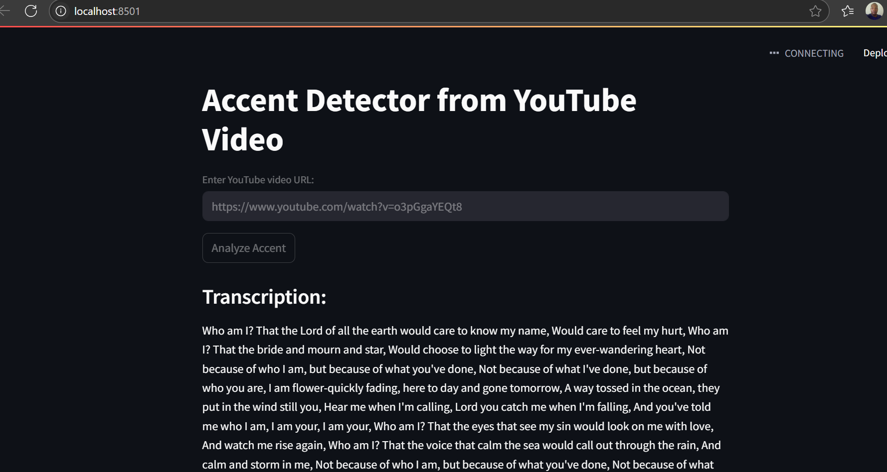

# 🗣️ English Accent Detection Tool

## Overview

This project is a practical tool built for REM Waste as part of a technical interview challenge. It accepts a **public video URL** (MP4 or Loom link), extracts the **audio**, and uses AI models to classify the **English accent** of the speaker. It also provides a **confidence score** and a short explanation to assist with spoken English evaluations during hiring.

## 🔍 Features

- 🎥 Accepts public video links (MP4, Loom)
- 🔊 Extracts audio using `ffmpeg`
- 🧠 Transcribes speech with OpenAI’s Whisper model
- 🌍 Classifies speaker’s English accent:
  - American
  - British
  - Australian
- 📊 Provides a confidence score (0–100%)
- ✏️ Includes a brief summary of the classification

Screenshot:



## 💡 Use Case

The tool is designed to assist hiring managers in evaluating the clarity and regional accent of English-speaking candidates in video submissions. It can serve as an internal screening aid.

---

## ⚙️ Setup Instructions

### 1. Clone the Repository

```bash
git clone https://github.com/harrisonokoth/accent-detector.git
cd accent-detector


How to run:
streamlit run app.py
